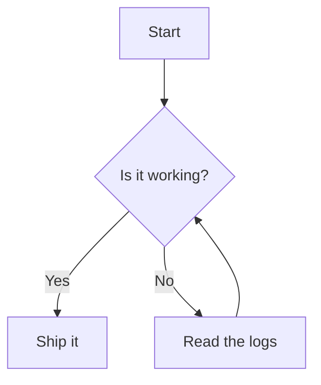

# mdview sample

Some **bold**, _italic_, ~~strikethrough~~, and a [link](https://example.com).

## Task list

- [x] render markdown
- [x] syntax highlighting
- [ ] world domination

## Table

| left | center | right |
| :--- | :----: | ----: |
| foo  |  bar   |   baz |
| 1    |   2    |     3 |

## Code with copy button

```go
package main

import "fmt"

func main() {
    fmt.Println("hello, mdview")
}
```

## Mermaid



## Inline `code` and a quote

> Markdown is a lightweight markup language.

## Footnote

Here's a footnote reference[^1].

[^1]: And here is the footnote text.
